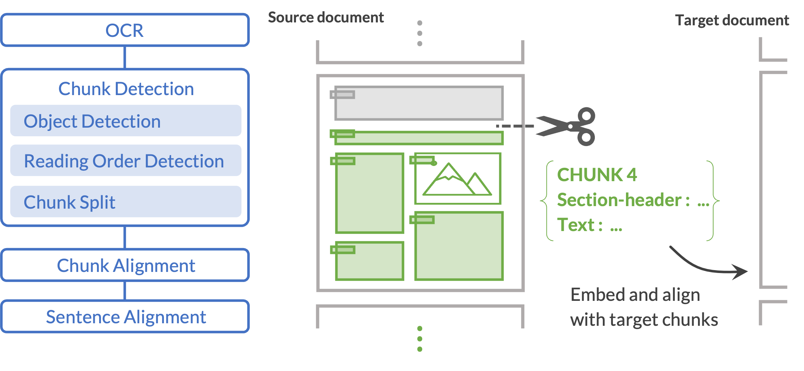
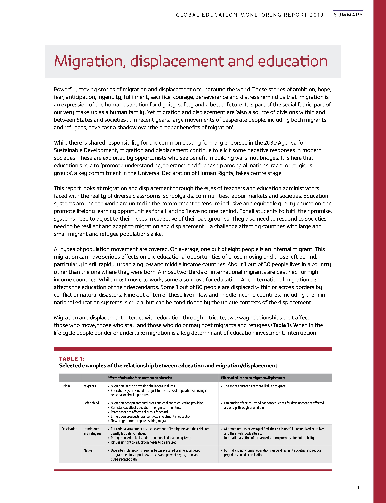

Layout-Based Chunk Alignment
=========
**Layout-based chunk alignment (Layout-CA)** is a layout-aware alignment module designed for building parallel corpora directly from bilingual document images. Positioned between document-level and sentence-level alignment, it identifies and aligns semantically coherent chunks by integrating textual similarity with layout information. This intermediate representation provides a stable structural basis, enabling more accurate and robust sentence alignment within aligned chunk pairs.

A *chunk* in this framework denotes a coherent textual unit in which readers perceive a continuous narrative or topical theme. In practice, chunks often correspond to articles or sections in journals and similar structured documents.


&nbsp;
&nbsp;

## Model Description
### Overview

<p align="center">
  &nbsp;&nbsp;&nbsp;&nbsp;&nbsp;&nbsp;&nbsp;&nbsp;&nbsp;&nbsp;&nbsp;&nbsp;&nbsp;&nbsp;
  &nbsp;&nbsp;&nbsp;&nbsp;&nbsp;&nbsp;
  
</p>
<p align="center">
  <em>Figure 3: Overview of the Layout-CA pipeline and an example document pair. <br>
  (See <a href="data">data</a> for more info on material and copyright)</em>
</p>

<!-- <figure>
  
  <figcaption>
    Figure 1: Overview of the layout-based chunk alignment pipeline.
  </figcaption>
</figure> -->


#### (i) Chunk detection
This process consists of 3 subprocesses, which are orderly OCR & Object Detection, Reading Order Detection, and Chunk Split. See the [paper](#citation) for details. We implemented the pre-trained [YOLO](https://huggingface.co/hantian/yolo-doclaynet). 

#### (ii) Chunk alignment
This process matches source and target chunks. It calls multilingual [Sentence-BERT](https://huggingface.co/sentence-transformers/paraphrase-multilingual-mpnet-base-v2) and embeds the texual information of each chunk. It calculates similarity scores between the source and target chunks and matches the proper ones which meets a threshhold. The score function is explained in [paper](#citation).

#### (iii) Sentence alignment
This process simply applies an existing sentence alignment model over the chunk-aligned texts. [Vecalign](https://github.com/thompsonb/vecalign) and [Bleualign](https://github.com/rsennrich/Bleualign) are implemented as default.

&nbsp;
&nbsp;

## Prerequisites


* Python 3.11
* [Tesseract](https://tesseract-ocr.github.io/tessdoc/Installation.html) for OCR

 If you are a conda user, you can run `conda install -c conda-forge tesseract`

##### Clone the repository
```bash
git clone https://github.com/mkino17/layout-ca.git
cd layout-ca/
```

##### Libraries
```bash
pip install -r requirements.txt
```

## Evaluation

To demonstrate the experiment from the paper, run the below code. 
This will go through the process with eval data in `data/to_eval` and create `result/eval`. 

```bash
python evaluation.py --evalset unesco \
    --align_method vecalign \ 
    --threshs_height_r 1.3 1.3
```
Note: GPU is recommended. You can still run on CPU, but it will take time processing about 100 pages.

|   |     |
|-------------|-------------------|
| `--evalset`  |  `unesco` or `shuffled_unesco`   |
| `--align_method` | `vecalign` or `bleualign` (vecalign is recommended as it's much lighter) |
| `--threshs_height_r`  | Height of Section-header where chunk is split (salience ratio)|
| `--is_ocr_only`  |  If you add this, it will demonstrate the case without using Layout-CA |


Output will look like the following.

<details>

```bash
Evalset: unesco
=======================================================
Chunk Detection
lang | #chunk(pred/gold) | P     R     F1    | Avg BLEU
-------------------------------------------------------
en   | 23.0/18.0    | 0.739 0.944 0.829 | 0.755 (18 pairs)

ja   | 18.0/18.0    | 0.889 0.889 0.889 | 0.201 (18 pairs)

=======================================================
Chunk Alignment
      | #pairs(pred/gold) | P     R     F1    | Avg BLEU
-------------------------------------------------------
ja   | 15.0/18.0    | 0.737 0.778 0.757 | 0.184 (18 pairs)

=======================================================
Sentence Alignment (vecalign, strict)
      | #pairs(pred/gold) | P     R     F1
-------------------------------------------------------
sent | 1153/1409         | 0.303 0.247 0.272

=======================================================
```
</details>

&nbsp;

## Usage with Your Own Documents

#### (i) Chunk detection

It expects to have paired images (PDF) to align in `data` directory (e.g. `data/en/sample-en.pdf`, `data/ja/sample-ja.pdf`). 
```bash
python main.py chunk-detect \
    --pdf_dir data \
    --langs en ja
    --model_ocr tesseract yomitoku
```
The code above will create `jpg_pages` directory in which the pdf files are formatted as jpg images. Following the processes, you'll have `result` directory in which the text/layout information is stored in json or txt files in different units; tokens, segments, segments_ordered, chunks. 

Both `--langs` and `--model_ocr` reflect `source` `target` order. Yomitoku is an OCR package for Japanese. Other laguages are available within the availability of Tesseract. Language codes can be checked in [codes/ocr_object_detection.py](codes/ocr_object_detection.py). See `main.py` for other arguments.


#### (ii) Chunk alignment

```bash
python main.py chunk-align --mode align
```
This will create `result/matches.json` in which the paired chunks are shown. You can add `--thresh_chunk_sim` (default=0.3) for minimum similarity score of aligned chunk pair. `--mode train` will train the score weights with `data/to_dev` data.

#### (iii) Sentence alignment

```bash
python main.py sent-align --align_method vecalign
```
This will create `result/sentences_aligned` and final txt files will be generated (`aligned-{src}.txt`, `aligned-{tgt}.txt`).

As mentioned in Evaluation, `vecalign` is recommended for the convenience. The model will load embedder from [sentence-transfomers](https://huggingface.co/sentence-transformers/paraphrase-multilingual-mpnet-base-v2). For `bleualign`, it will load [NLLB](https://huggingface.co/facebook/nllb-200-distilled-600M), thus will take more storage and also running time. 

&nbsp;


## Citation
To be filled. 
